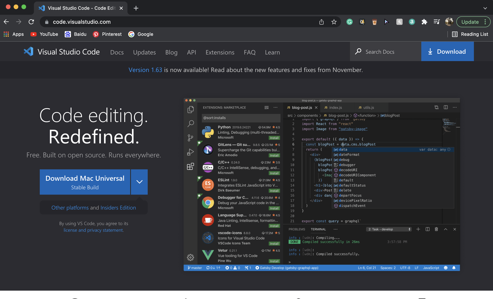
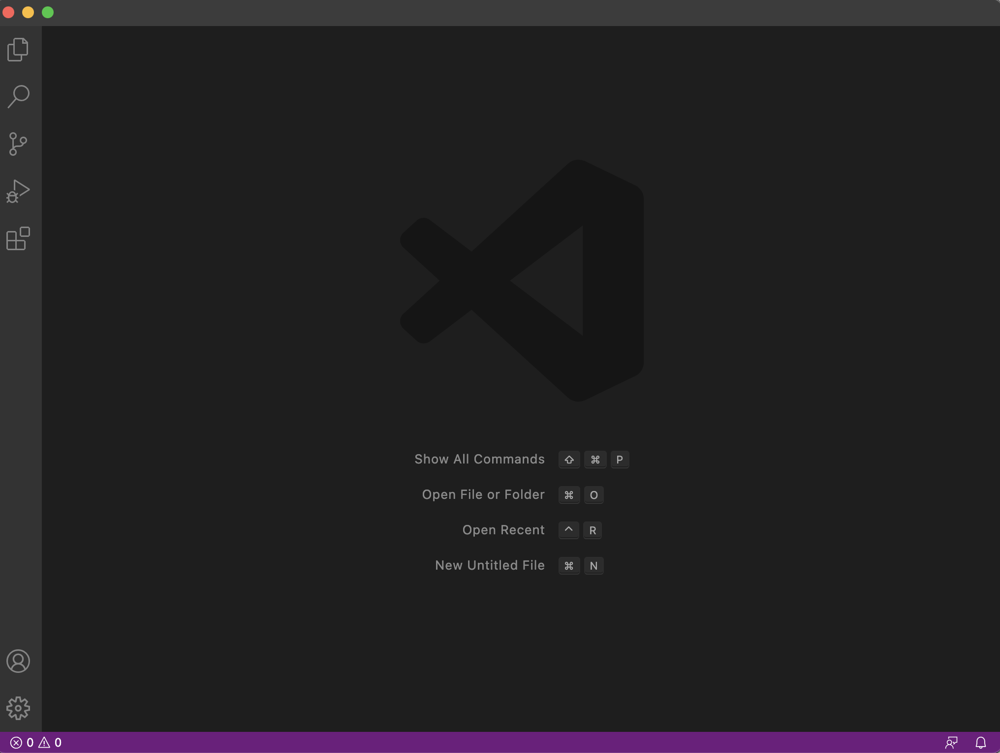

# Week 2 Lab Report: Remote Access
[January 14, 2022]

## Table of Contents:
1. Installing VS Code
2. Remotely Connecting
3. Trying Some Commands
4. Moving Files with `scp`
5. Setting an SSH Key
6. Optimizing Remote Running

**1. Installing VS Code**

*Note*: If VS Code is already installed on your computer, you can skip to step 2 (Remotely Connecting).

1.1 Open the Visual Studio Code website and follow the instructions to download Visual Studio Code for your computer.

1.2 After installing Visual Studio Code, the following window should show:

