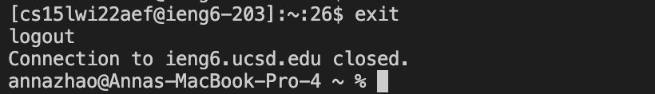
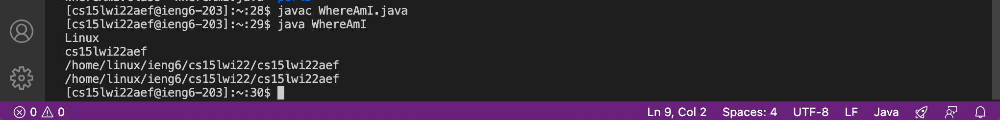

# Week 2 Lab Report: Remote Access
[January 14, 2022]

## Table of Contents:
1. Installing VS Code
2. Remotely Connecting
3. Trying Some Commands
4. Moving Files with `scp`
5. Setting an SSH Key
6. Optimizing Remote Running

**1. Installing VS Code**

*Note*: If VS Code is already installed on your computer, you can skip to step 2 (Remotely Connecting).

1.1 Open the Visual Studio Code website and follow the instructions to download Visual Studio Code for your computer.

1.2 After installing Visual Studio Code, the following window should open when you open the application:

**2. Remotely Connecting**

2.1 Look up course-specific account for CSE15L in this link [https://sdacs.ucsd.edu/~icc/index.php](https://sdacs.ucsd.edu/~icc/index.php)

2.2 Open Terminal in VS Code by clicking on Terminal in the control bar and selecting "New Terminal"

2.3 Type the following command into the terminal replacing "zz" with  course-specific account letters:

`ssh cs15lwi22zz@ieng66.ucsd.edu`

2.4 When logging in for the first time, the following message appears. Type yes and press enter.

2.5 Type password and press enter and the following results:

**3. Trying Some Commands**

3.1 Run a few commands both on your computer and on the remote computer

*Own Computer*:

--cd changes the directory

--ls lists the files, l means long-listing, a lists hidden files, and t shows the last edited time

*Remote Computer*

--cp copies, cat reads files, can only be used if we have permission to read the files

--exit or Ctrl-D exits the remote control

**4. Moving Files with `scp`**

4.1 Create file named "WhereAmI.java" with following contents

4.2 Compile using `javac` and run using `java` on own computer

--returns the user's operating system, username, home, and directory

4.3 Login to remote computer in the same directory as this file with the command `scp WhereAmI.java [account name]:~/` and then login to the remote computer again using `ssh` and run the ls command and WhereAmI.java should be seen

4.4 Run WhereAmI.java on the remote computer

--however when we want to edit and rerun the file on the remote computer, this process is inefficient as it took our group around 1.5 minutes to do that one time