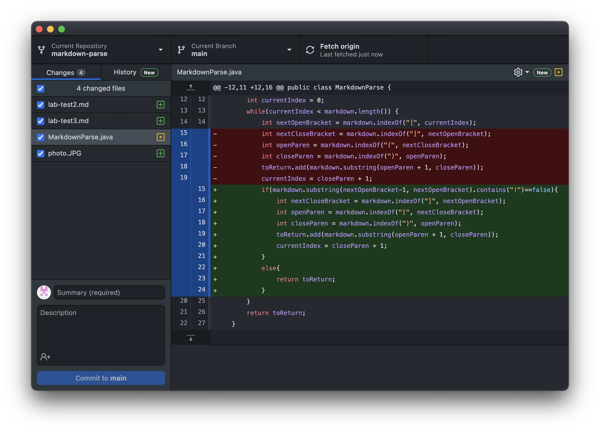
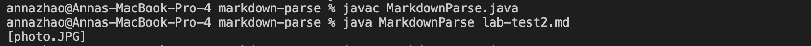

# Week 4 Lab Report: Incremental Programming & Debugging
[January 28, 2022]

## Table of Contents:
1. Code Change #1
2. Code Change #2
3. Code Change #3

**1. Code Change #1**

1.1 Code Change Screenshot:

1.2 Test File for Failure-Inducing input:
[Image Test](/Users/annazhao/Documents/GitHub/markdown-parse/lab-test2.md)

1.3 Symptom of Failure-Inducing input:

1.4 Relation:
