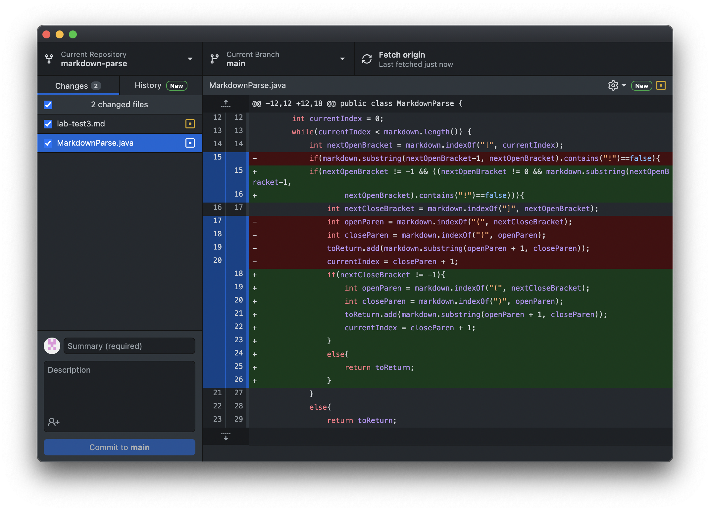
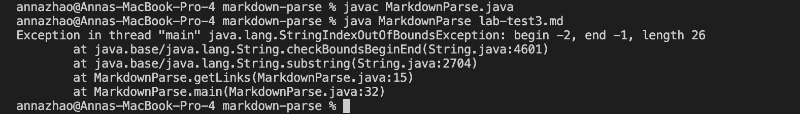

# Week 4 Lab Report: Incremental Programming & Debugging
[January 28, 2022]

## Table of Contents:
1. Code Change #1
2. Code Change #2
3. Code Change #3

**1. Code Change #1**

1.1 Code Change Screenshot:

1.2 Test File for Failure-Inducing input:
[Image Test](https://annaz0506.github.io/markdown-parse/lab-test2.html)

1.3 Symptom of Failure-Inducing input:

1.4 Relation:

The input of the image also uses square brackets and parantheses, which is what the code relies on primarily to return the links in an array. Hence, when providing an image markdown file to the code, it still returns the contents in the parantheses although it is not a link, this is the symptom that we see. From this, we can see that there is a bug in the code where it only focuses on the brackets and parantheses and ignores the other symbols that may be essential in defining what markdown is being used.

**2. Code Change #2**

2.1 Code Change Screenshot:

2.2 Test File for Failure-Inducing input: [No Brackets Test](https://annaz0506.github.io/markdown-parse/lab-test3.html)

2.3 Symptom of Failure-Inducing input:

2.4 Relation:

The input that was used for this section did not have square brackets, however it still had parentheses. The symptom was that the code continued running until the results had to be added in to the ArrayList but the indexes were negative numbers, returning an error. From this, we can see that there is a bug in the code as the code continues to run even when the brackets are not found.