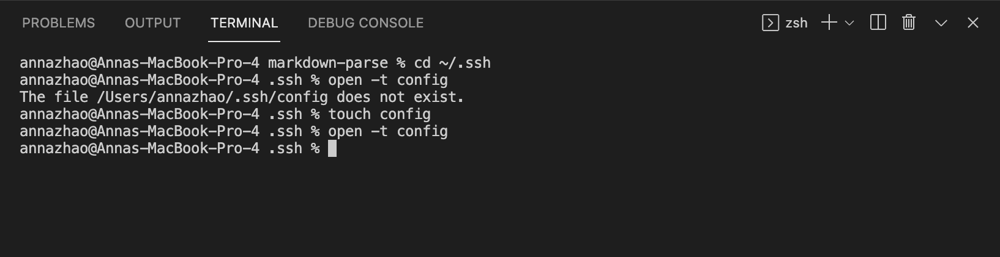
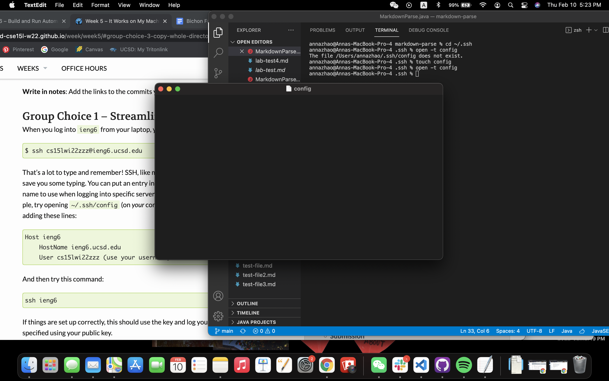

# Week 6 Lab Report: Streamlining `ssh` Configuration
[February 11, 2022]

## Table of Contents:
1. Creating/Opening and Editing `.ssh/config`
2. `ssh` Login To Account After 
3. `scp` Command To Account After

**1. Creating/Opening and Editing `.ssh/config`**

Opening `ssh` and creating `.ssh/config`:

I first attempted to open `.ssh/config` but realized I do not have the file, but only the directory. Therefore I changed my directory to `ssh` in my terminal and created the config file by using the `touch` command. 

Opening newly created `.ssh/config`:

Then I opened the empty file using the `open` command in terminal to ensure that the file has been successfully created.

**2. `ssh` Login To Account After**