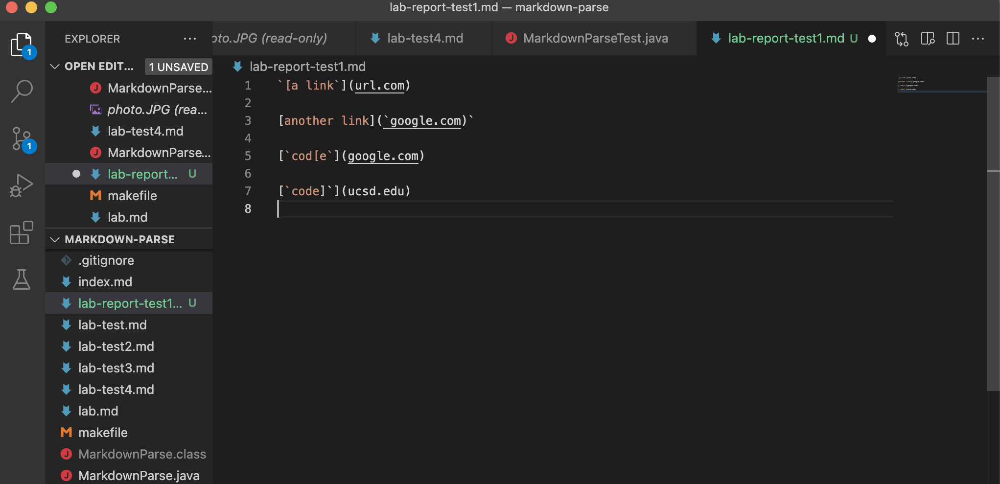
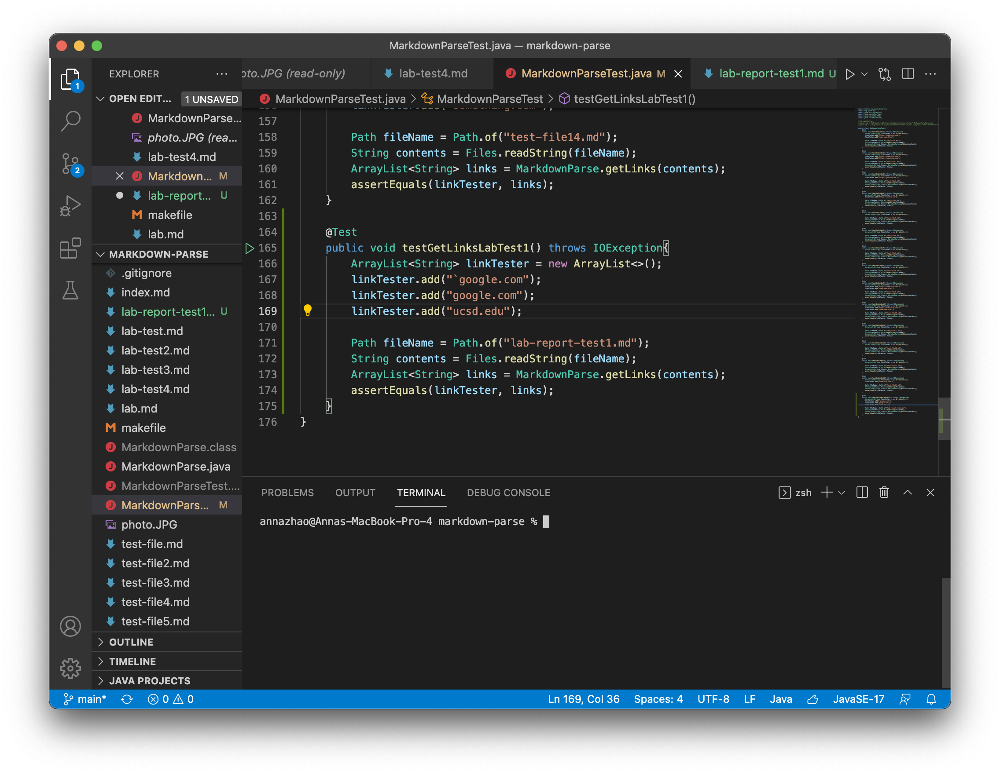
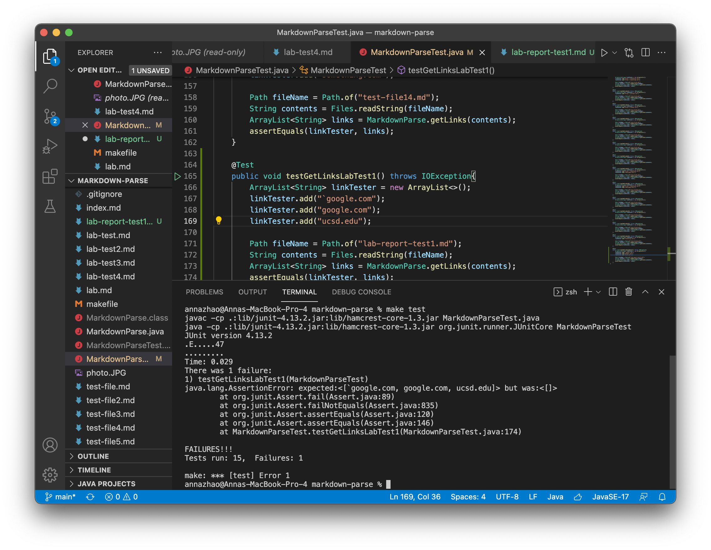
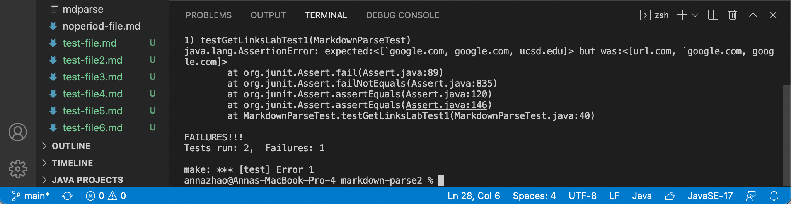
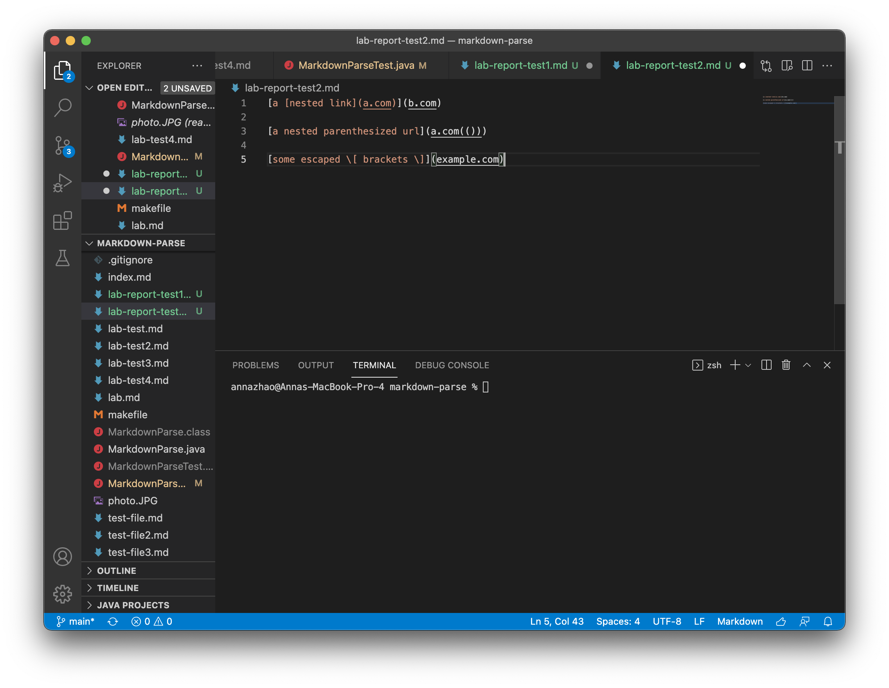
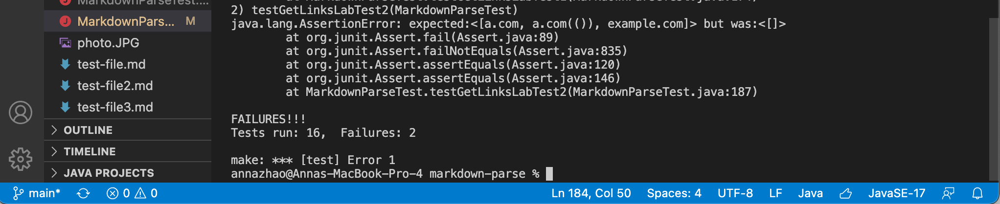
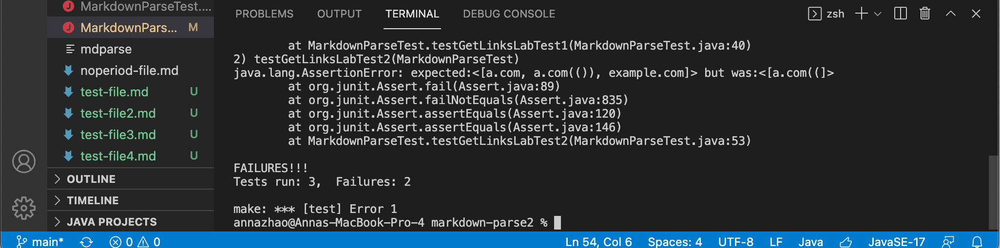
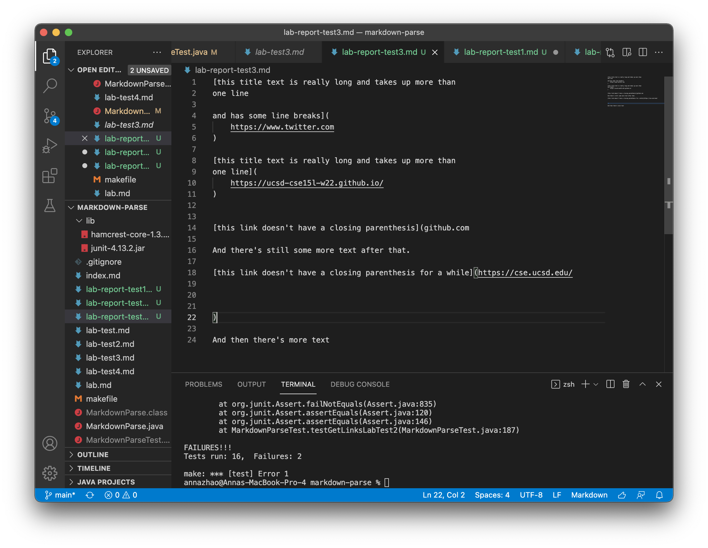
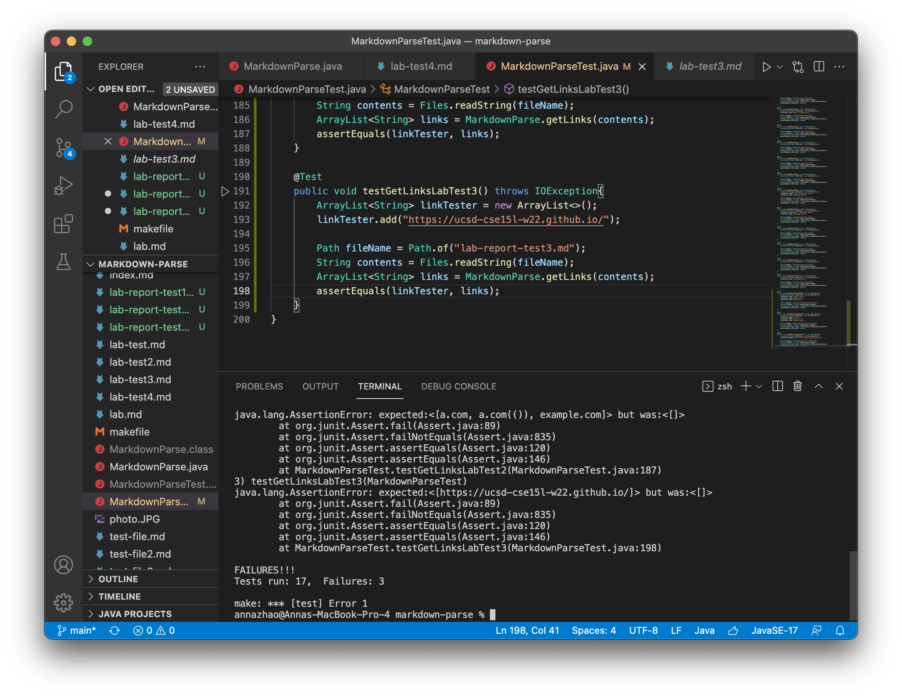
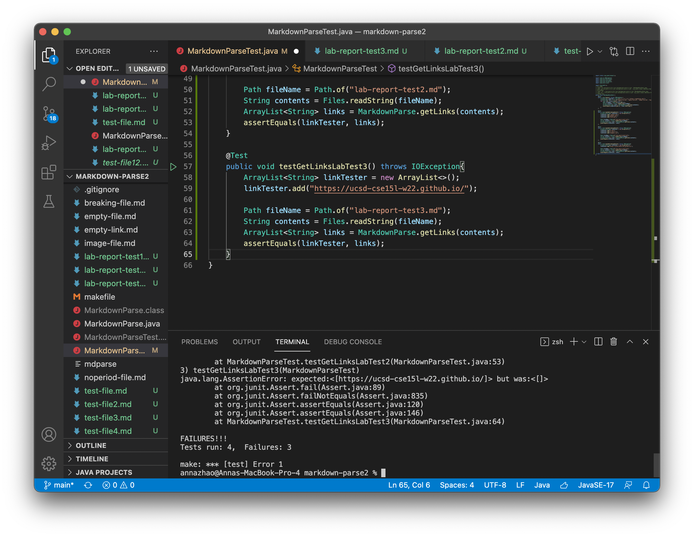

# Week 8 Lab Report: Code Review & Debugging
[February 25, 2022]

## Table of Contents:
1. Snippet 1
2. Snippet 2
3. Snippet 3

**Markdown Repositories**

[My Markdown](https://github.com/annaz0506/markdown-parse)

[Reviewed Markdown](https://github.com/merrickqiu/markdown-parse)

**1. Snippet 1**

Test file of snippet 1:

Tester code for snippet 1:

Output for my implementation:

Output for reviewed implementation:

**2. Snippet 2**

Test file of snippet 2:

Tester code for snippet 2:

Output for my implementation:

Output for reviewed implementation:

**3. Snippet 3**

Test file of snippet 3:

Tester code for snippet 2:

Output for my implementation:

Output for reviewed implementation:
