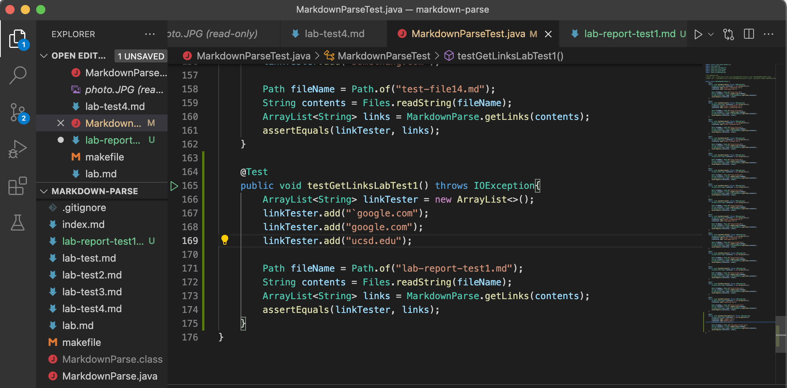
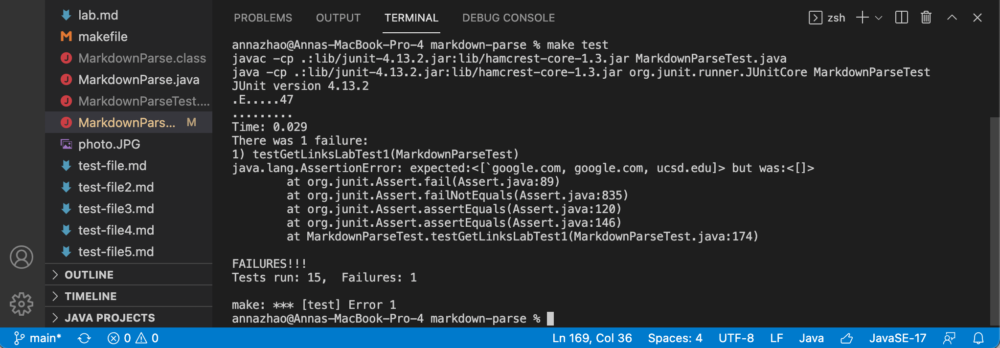
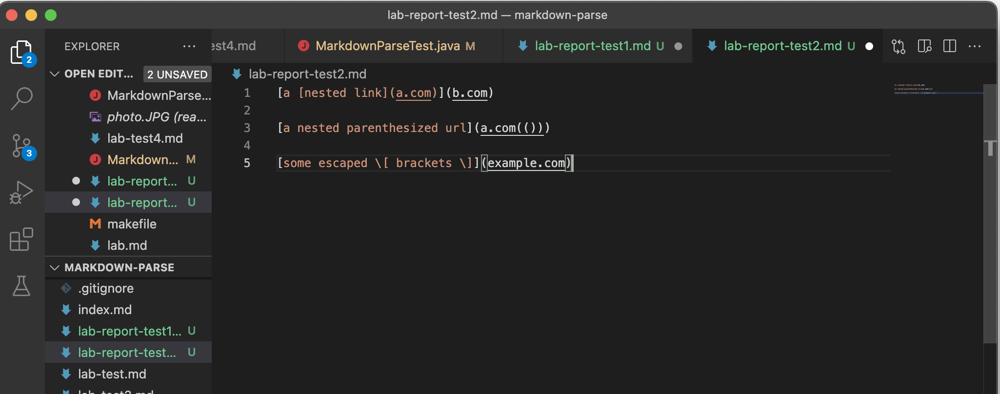
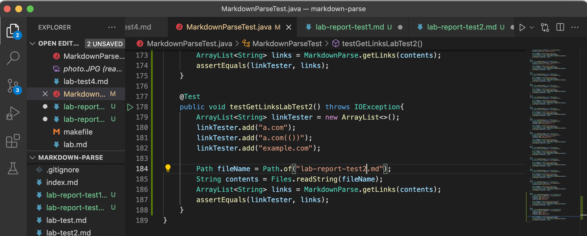
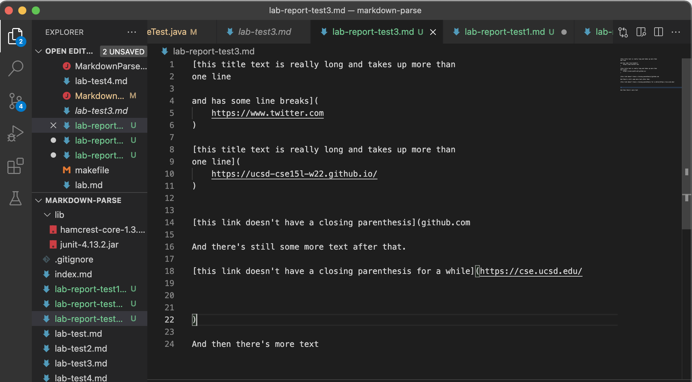
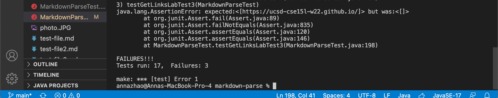
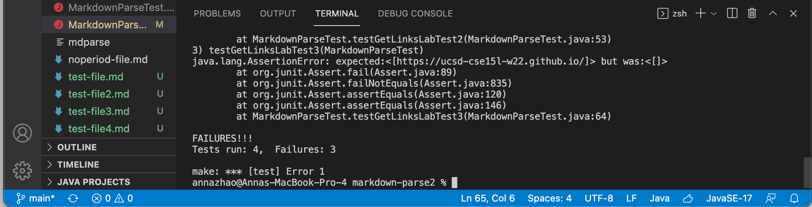

# Week 8 Lab Report: Code Review & Debugging
[February 25, 2022]

## Table of Contents:
1. Snippet 1
2. Snippet 2
3. Snippet 3

**Markdown Repositories**

[My Markdown](https://github.com/annaz0506/markdown-parse)

[Reviewed Markdown](https://github.com/merrickqiu/markdown-parse)

**1. Snippet 1**

Test file of snippet 1:

Tester code for snippet 1:

Output for my implementation:

Output for reviewed implementation:

For this snippet, there would need to be a more involved change that not only checks for the backticks, but also checks for the repetition of brackets within the link (nested links). There would be more code added to the test and not just changing the original code.

**2. Snippet 2**

Test file of snippet 2:

Tester code for snippet 2:

Output for my implementation:

Output for reviewed implementation:

For this snippet, there would have to be multiple changes made to the way the code is structured. We would also have to change the conditions for what happens if two open brackets/parenthesis are found in a row.

**3. Snippet 3**

Test file of snippet 3:

Tester code for snippet 2:

Output for my implementation:

Output for reviewed implementation:

For this snippet, we can change it more efficiently than the previous two. The code right now already looks for a line break in the file so if we change it so if there is text after one line break it still returns the link, it will solve the problem. Hence, we change this by adding one line with regex for other letters.