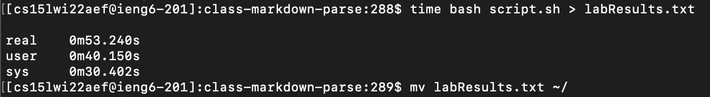
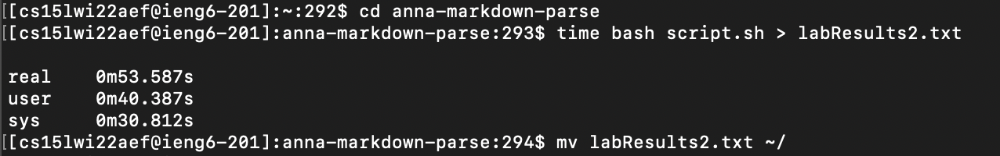
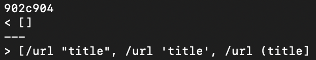
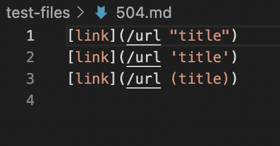

# Week 10 Lab Report: Commonmark & Markdown Parse
[March 11, 2022]

## Table of Contents:
1. How to find tests with different results
2. First Test Correctness and Changes
3. Second Test Correctness and Changes

**1. How to find tests with different results**

Firstly I ran the command `time bash script.sh > labResults.txt` in the shared file for the class and then the same command for my group's file but changed `labResults.txt` to `labResults2.txt`.

Then I moved both of the files to the same directory and used the command `diff labResults.txt labResult2.txt` to find generate a list of the results that were different for each tester.

**2. First Test Correctness and Changes**

The first test I chose that was different for each tester was test 504.

For the shared class code, the output was an empty array while for our group's code, the output was an array with the contents within the brackets of the test file. I believe that the correct output is the one of the shared class code because although the formatting of the markdown is in that for a link, the actual text within the bracket does not follow the format for a link. In reality, a link needs a domain and title, however the text in the parentheses do not have a domain like .com. This should be corrected to ensure that the links are actually valid on a webpage.